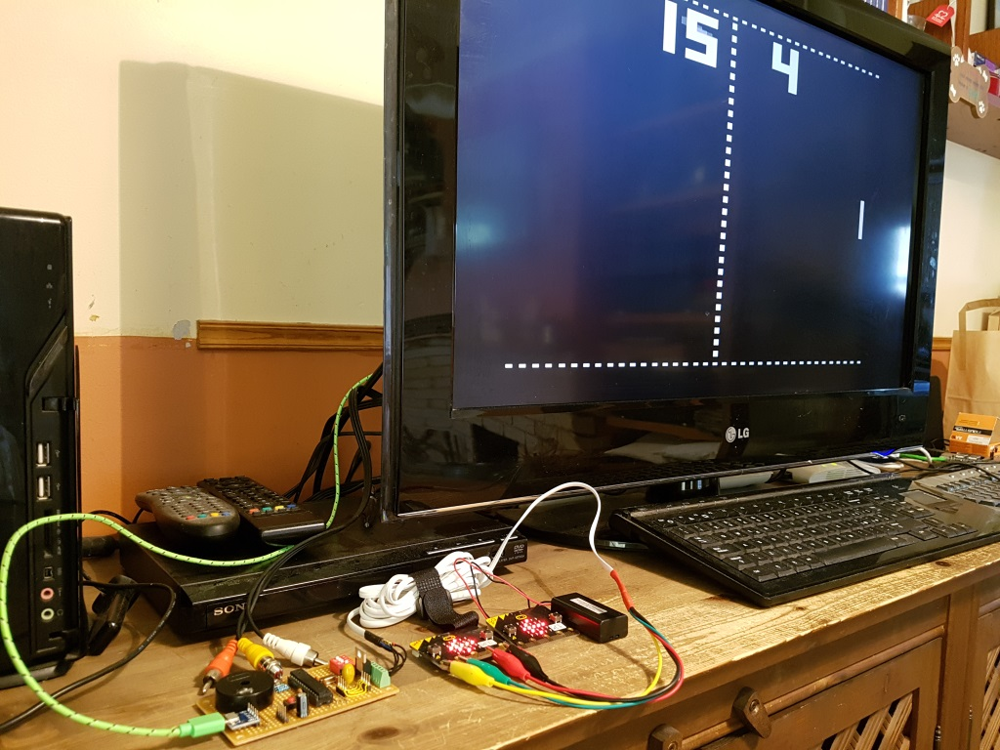
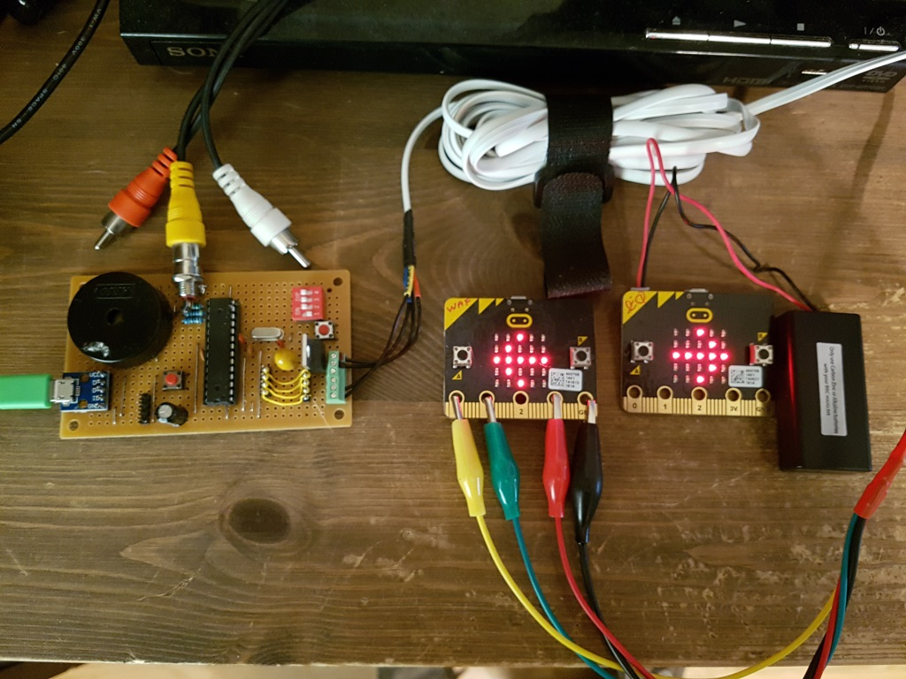
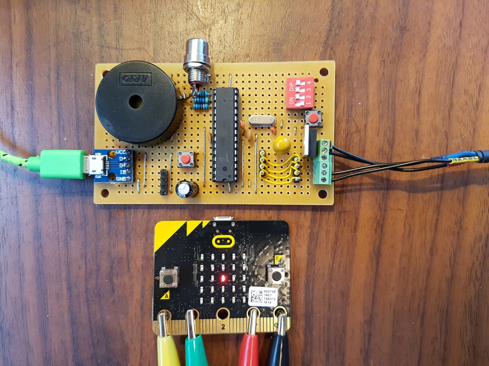
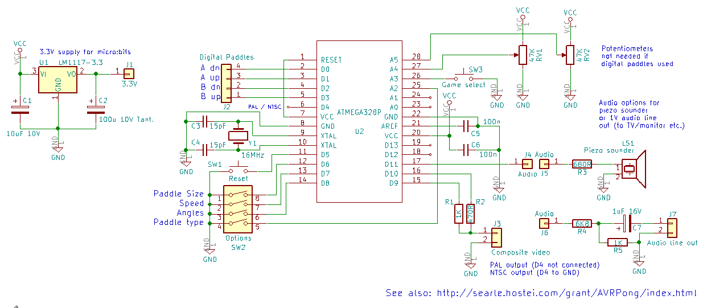

# Microbit-TVPong

Play the classic Pong game on a TV (composite video) - using BBC micro:bits as paddles. Bluetooth also supported!

 	
This is Grant Searle's fantastic Pong game for the Atmel/Microchip ATMEGA328P, modified to also support digital up/down paddles.

Original code at: http://searle.hostei.com/grant/AVRPong/index.html

The above page also has details of the microcontroller circuit that forms the basis of this project (with additions).

The aim was to produce a fun game that could be used in STEM coding workshops using BBC micro:bits as digital game paddles.

Video: https://youtu.be/jDqk6mIApZk

This repo comprises:

1) The modified Pong code, which supports the following additional inputs to the ATMEGA:

* Pin D0 = Left player UP
* Pin D1 = Left player DOWN
* Pin D2 = Right player UP
* Pin D3 = Right player DOWN
* Pin A2 = Analogue / Digital paddles select (no connection = analogue, pin to GND = digital)

There's also some consts and variables to support alternate pin definitions and to change the digital paddle movement speed -
see the source code comments. The comments also include some important information about the AVR fuse settings and supported
Arduino IDE versions (1.6).

2) The microbit-paddle* and microbit-radio files

There are two game controller (paddles) files and one remote control file. These files are ready to upload to a micro:bit, or import into the makecode environment for examination and modification:

The 'paddle' files use the A and B buttons on the micro:bit as digital paddle controls - connect micro:bit pins P0 and P1 
to the up/down inputs on the ATMEGA328P. You will also need a connection between micro:bit GND and the 0V rail of the ATMEGA circuit. The prototype pong board in the image below also has a 3V regulator to supply power to the micro:bits - alternatively you could use a battery pack or USB (but that leads to a bit of a mess of cables!)

* The paddle-bt file supports controlling the Micro:bit from both the A B buttons and a bluetooth-paired device - tested with a Samsung Galaxy S7 and the Bitty controller software (http://www.bittysoftware.com/apps/bitty_controller.html).

* The paddle-with-radio file uses the A B buttons AND supports a remote control micro:bit connected using the inbuilt radio so that you can play pong without wires! Simply program a second micro:bit with the microbit-radio-remote.hex file.

*micro:bit wired digital paddle and a battery-operated remote micro:bit*

When first started, the radio-enabled paddles will ask you to choose whether they are paddle A or paddle B - hold down the relevant button until the choice is registered. Likewise with the remote control micro:bits - Press and hold A or B on startup so that you have a remote control for each paddle. All radio comms is via micro:bit radio group 16.

To differentiate the two micro:bit types, the paddles display 'PAD!' on startup, and the remote controls show 'RMT!'

*For a bit of fun, you can have multiple A or B remote control micro:bits for a team tug of war!*

**Stripboard version**

The header pins on the left are for the paddle potentiometers (not used for this application). The green terminals on the right are for the alternative digital inputs from the micro:bits, and the large component to the left of the terminals is an LM1117 providing 3.3V from the 5V USB input to power the micro:bits.

The DIP switches set ball speed, paddle size, bounce angles and the added option to choose between analogue or digital paddles. The two buttons are game reset (right) and game select (left).

The code for the game can be uploaded to an Arduino Uno if you don't want to build your circuit from scratch. There's also ready-made boards that hold just the 328P - eg: the Bitsbox "Barebones 'Duino PCB" (https://www.bitsbox.co.uk) 

**Schematic**

Have fun!
